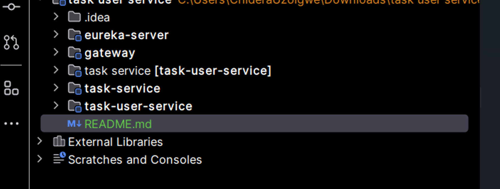
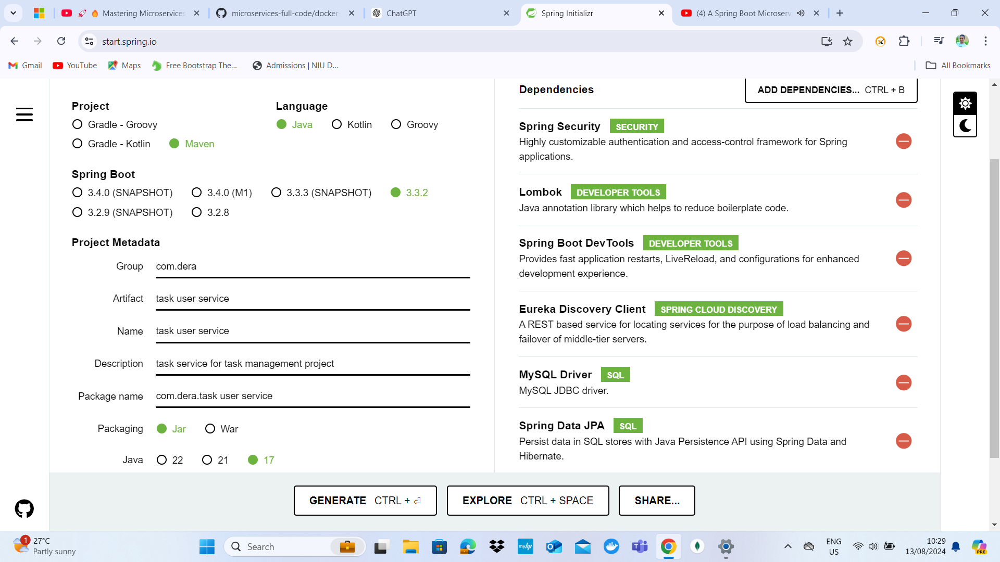
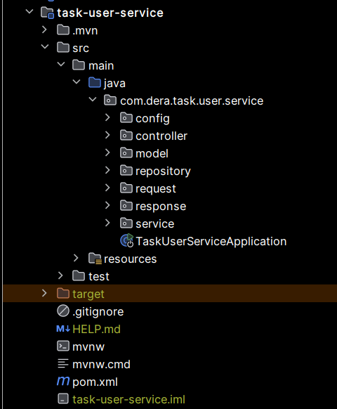
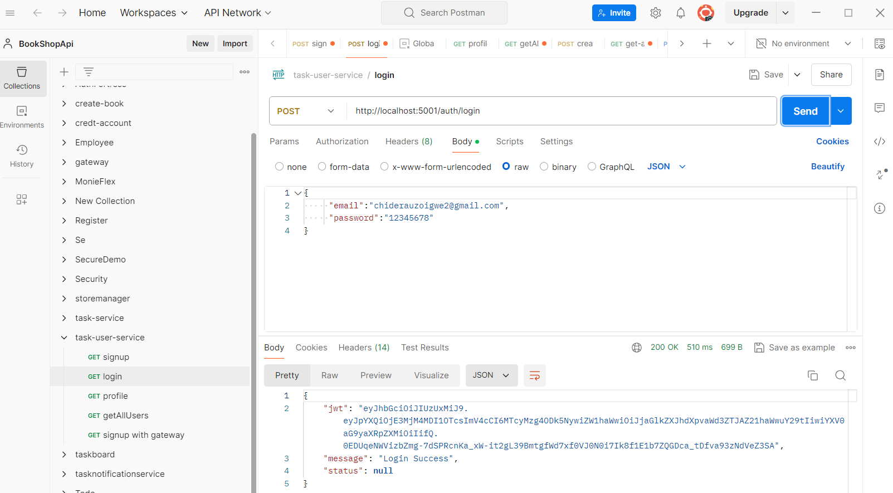
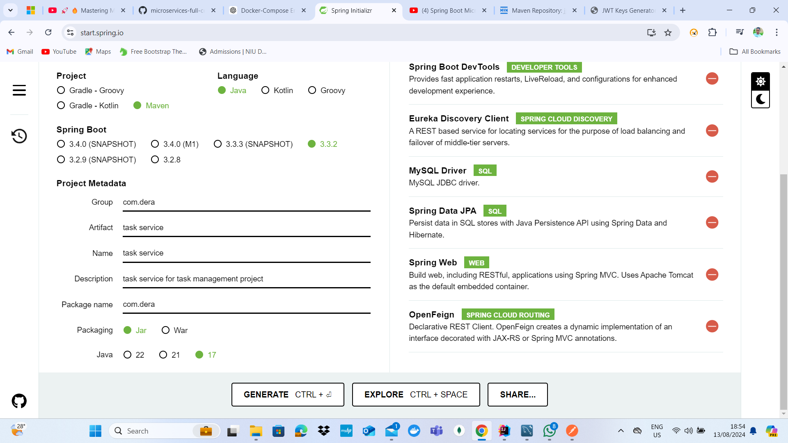
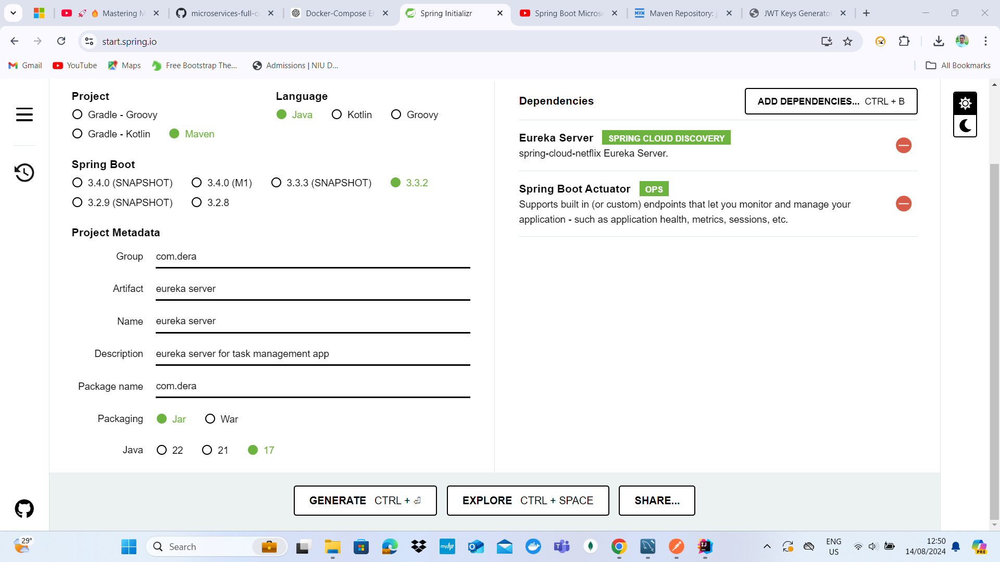
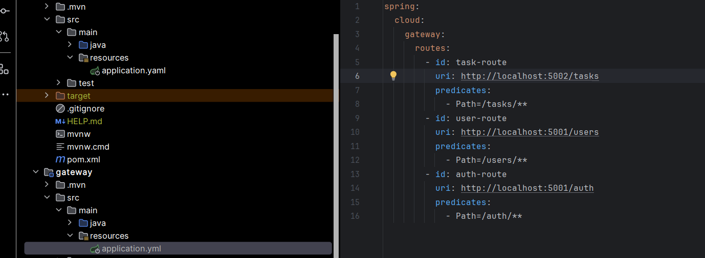

# Task Management Microservices System

## Overview
This is a task management microservices system built with Java 17, Spring Boot, and Maven. The system consists of two main services: **User Service** and **Task Service**, along with a **Gateway** for routing and an **Eureka Server** for service discovery. The project is organized using a **mono repo approach**, where all microservices, the registry, and the gateway are contained within a single repository and folder structure for Unified Version Control, Easier Refactoring, Shared Code and Libraries and Consistent Development Environment. All services are documented and tested using Postman.


---


## Architecture
- **User Service**: Handles user authentication and profile management.
- **Task Service**: Manages CRUD operations for tasks.
- **Gateway**: Routes requests to the appropriate microservice.
- **Eureka Server**: Acts as the service registry for discovering services.

## Technologies Used
- **Java 17**: The programming language used to build the microservices.
- **Spring Boot**: Framework to simplify the creation of production-ready applications.
- **Spring Cloud Eureka Discovery**: Provides service registration and discovery functionality.
- **Spring Security**: Used for securing the application with JWT authentication.
- **Spring Data JPA**: Manages data access using the Java Persistence API.
- **MySQL**: The relational database used for data storage.
- **OpenFeign**: Simplifies inter-service communication via HTTP.
- **Lombok**: Reduces boilerplate code by generating common methods like getters and setters.
- **Maven**: Build automation tool used to manage dependencies and project build lifecycle.
- **IntelliJ IDEA**: Integrated Development Environment (IDE) used for coding, debugging, and running the services.
- **Postman**: Tool used for testing and documenting the API endpoints.

## Services Overview

### 1. User Service


- **Port**: `5001`
- **Dependencies**:
    - **Spring Security**: Secures the application with JWT authentication.
    - **Lombok**: Reduces boilerplate code by generating getters, setters, and other common methods.
    - **Spring Web**: Provides necessary functionality to build RESTful web services.
    - **Spring Boot Starter Data JPA**: Simplifies data access using Java Persistence API (JPA).
    - **MySQL Driver**: Enables communication between the application and the MySQL database.
    - 
---


- **Entities**:
    - **User**: Represents a user in the system.

- **Controllers**:
    - **AuthController**: Manages user signup and login with JWT authentication.
    - **UserController**: Provides endpoints to retrieve user profiles and a list of all users.
    - 


- **Endpoints**:
    - `POST /auth/signup`: Signup a new user.
    - `POST /auth/login`: Login a user and obtain a JWT.
    - `GET /user/profile`: Retrieve the profile of the logged-in user.
    - `GET /user/all`: Retrieve a list of all users.


---
- **Configuration**:
    - Configured to run on a custom server port `5001` using `application.yml`.

### 2. Task Service

- **Port**: `5002`
- **Dependencies**:


    
- **Spring Web**: Used to create RESTful web services.
    - **Spring Boot DevTools**: Provides automatic restarts and live reload features for development.
    - **Lombok**: Reduces boilerplate code by generating common methods.
    - **Eureka Client**: Registers the service with the Eureka Server for discovery.
    - **Spring Boot Starter Data JPA**: Manages data access using JPA.
    - **MySQL Driver**: Facilitates communication with the MySQL database.
    - **OpenFeign Client**: Simplifies making HTTP requests to other microservices.

- **Entities**:
    - **Task**: Represents a task in the system.

- **Controllers**:
    - **TaskController**: Manages CRUD operations for tasks.

- **Endpoints**:
    - `POST /tasks`: Create a new task (Only admins can create task. The roles are extracted from the JWT. This is achieved by communicating with the User Service using Open Feign Client).

  
    - `GET /tasks/{id}`: Retrieve a task by ID.
    - `PUT /tasks/{id}`: Update a task by ID.
    - `DELETE /tasks/{id}`: Delete a task by ID.
    - `GET /tasks`: Retrieve a list of all tasks.

- **Configuration**:
    - Configured to run on a custom server port `5002` using `application.yml`.

### 3. Eureka Server
- **Port**: `8070`
- **Dependencies**:
- 
    - **Eureka Server Spring Cloud Discovery**: Manages service registration and discovery.
    - **Spring Boot Actuator**: Provides production-ready monitoring and management capabilities.

- **Configuration**:
    - The Eureka Server is configured to run on port `8070` and allows all services to register and discover each other.
    - 

### 4. Gateway
- **Port**: `8080`
- **Dependencies**:
    - **Spring Cloud Gateway**: Provides a simple, yet effective way to route API requests to the appropriate services.
  
    - .png)

- **Configuration**: Declarative Configuration was used for Gateway configuration.
  This approach the routes and other configurations for the gateway using configuration files. This method is straightforward and involves setting up your gateway application with YAML or properties files. I used `application.yml`.
    - Configured with routes for `UserController`, `AuthController`, and `TaskController`.
    - Routes are defined with an ID, URI, and predicate for each controller.
    - 

## Communication
- **OpenFeign Client**: Services communicate with each other using the OpenFeign Client, simplifying HTTP requests between microservices.
- **Gateway**: All external API requests are routed through the Gateway, which directs them to the appropriate microservice.

## Getting Started
### Prerequisites
- Java 17
- Maven
- MySQL
- IntelliJ IDEA

### Cloning the Repository

Before running the services, you need to clone the repository from Git. Follow these steps:

1. Open your terminal or command prompt.

2. Navigate to the directory where you want to clone the project.

3. Run the following command to clone the repository:

   ```bash
   git clone `https://github.com/Deraclassic/TaskBoardMicroservicesApp`
   ```

4. Navigate into the cloned repository:

   ```bash
   cd TaskManagementMicroServiesApp
   ```

  


### Running the Services
1. **Eureka Server**:
    - Navigate to the `eureka-server` directory.
    - Run the server using `mvn spring-boot:run`.

2. **User Service**:
    - Navigate to the `user-service` directory.
    - Run the service using `mvn spring-boot:run`.

3. **Task Service**:
    - Navigate to the `task-service` directory.
    - Run the service using `mvn spring-boot:run`.

4. **Gateway**:
    - Navigate to the `gateway` directory.
    - Run the gateway using `mvn spring-boot:run`.

### Testing
- All endpoints are documented and can be tested using Postman. Ensure that the Eureka Server and all services are running before executing API requests.

## License
This project is licensed under the MIT License - see the [LICENSE](LICENCE) file for details.

## Contact
- For Any enquiries, contact Chidera Uzoigwe on chiderauzoigwe2@gmail.com.

## Author
Chidera Cynthia Uzoigwe.